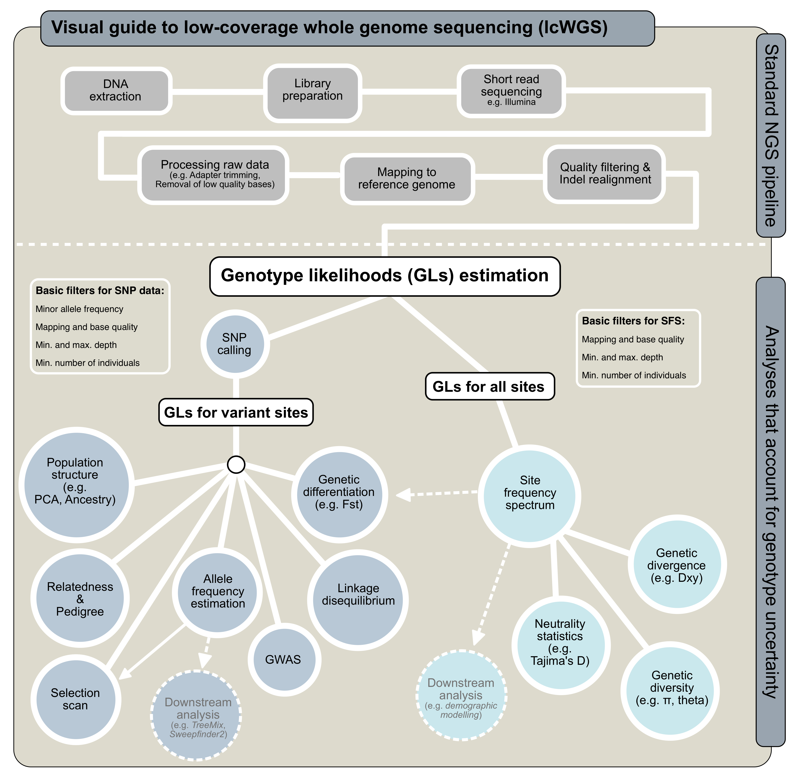

Population genomic analysis of low-coverage whole genome data
================

  - [Overview](#overview)
  - [Before you start](#before-you-start)
  - [Analyses based on variant sites](#analyses-based-on-variant-sites)
  - [Analyses based on all sites](#analyses-based-on-all-sites)

## Overview

This collection of scripts cover the data analysis part of the
low-coverage whole genome sequencing pipeline (i.e. bottom part of the
following diagram), going from quality checked bam files to various
population genomic inference. It is primarily ANGSD-based, but will also
incorporate other downstream analysis software programs that can take
ANGSD files at input.

We aim to generate a pipeline that is user-friendly and highly flexible
(e.g. it should be compatible to most study organisms, sequencing
configuration, and computing server structure). However, this is still a
work in progress. Please submit a GitHub issue if you encounter any
problems, and we will try to get back to you in a timely fashion.

## Before you start

We recommend you to have a project base directory that contains the
following subdirectories:

  - `bam` bam files

  - `nohups` nohup log files

  - `sample_lists` small text files, such as lists of bam files

  - `markdowns` markdown files tracking the workflow; it is recommended
    that you first create Rmd files using Rstudio, and knit these into
    GitHub markdown format

  - `angsd` angsd output files

  - `scripts` scripts specific to your projects (e.g. merging certain
    bam files)

## Analyses based on variant sites

  - [SNP
    calling](https://github.com/therkildsen-lab/genomic-data-analysis/blob/master/markdowns/angsd_global_snp_calling.md)

  - [Linkage disequilibrium estimation and
    pruning](https://github.com/therkildsen-lab/genomic-data-analysis/blob/master/markdowns/ld.md)

  - [Principal component
    analysis](https://github.com/therkildsen-lab/genomic-data-analysis/blob/master/markdowns/pca.md)

  - [Admixture
    analysis](https://github.com/therkildsen-lab/genomic-data-analysis/blob/master/markdowns/admixture.md)

  - [Allele frequency
    estimation](https://github.com/therkildsen-lab/genomic-data-analysis/blob/master/markdowns/get_maf_per_pop.md)

  - [Fst
    estimation](https://github.com/therkildsen-lab/genomic-data-analysis/blob/master/markdowns/fst.md)

## Analyses based on all sites

  - [Population-level genetic
    diversity](https://github.com/therkildsen-lab/genomic-data-analysis/blob/master/markdowns/diversity_per_pop.md)

  - [Individual-level genetic
    diversity](https://github.com/therkildsen-lab/genomic-data-analysis/blob/master/markdowns/diversity_per_ind.md)
